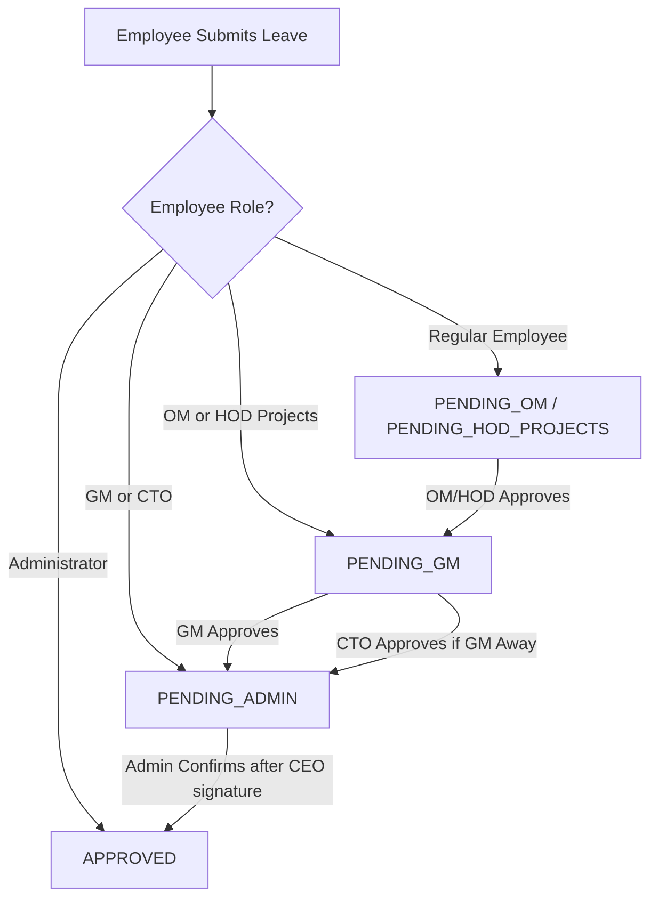
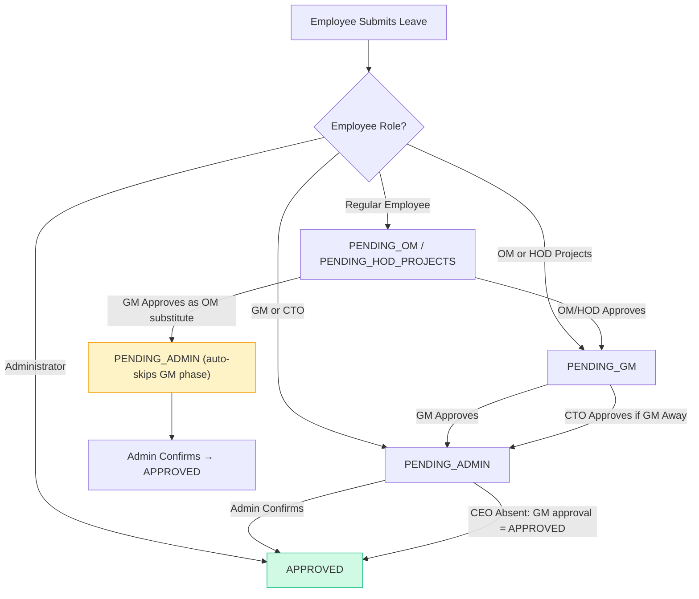

# Delegation & Substitute Approval System — Analysis & Implementation Plan

## My Understanding of Your Requirements

After thoroughly analyzing the codebase, here is my interpretation of each feature request, mapped to the current system architecture:

---

### 1. CEO Absence → GM Auto-Approves on CEO's Behalf

**Your request:** If the CEO is absent, the GM should approve on their behalf — no manual CEO signature needed.

**My understanding:** Currently, the final step (Phase 3) is `PENDING_ADMIN`, where the Administrator downloads the PDF, gets the CEO to physically sign it, and then confirms in the system. You want to **bypass this manual CEO signature step** when the CEO is absent/away. Instead, the GM's approval at Phase 2 should be sufficient — the request should move directly from `PENDING_GM` → `APPROVED` (skipping `PENDING_ADMIN` entirely), with the GM effectively acting as the CEO's delegate.

> [!IMPORTANT]
> **Clarification needed:** Should the system auto-detect CEO absence (via the `isAway` flag or active leave like we do for GM), or should this be a manual toggle? Also — the CEO (nirupatel@alandick.co.ke) is currently blocked from all emails. Does this remain unchanged?

---

### 2. GM/OM Absence → GM Approves for Them + Auto-Approves Own

**Your request:** When GM or OM are absent, the GM should approve on their behalf, and if GM approves for them, it should also automatically approve his own approvals.

**My understanding:** This has two parts:

**Part A — OM Absence:** When the Operations Manager is away, the GM can step in and approve Phase 1 requests (`PENDING_OM`) on the OM's behalf. This already partially works since GM has higher privileges, but currently the system routes the request to `PENDING_GM` after OM approval — meaning the GM would need to approve twice (once as OM substitute, once as GM). You want: **when GM approves a Phase 1 request as OM substitute, it should auto-skip Phase 2 (GM approval)** and go directly to `PENDING_ADMIN`.

**Part B — GM Absence (self-referencing):** This seems to mean: if the GM is the one approving on behalf of the OM, his own pending GM approvals for those same requests should be automatically fulfilled. In other words, a single action by the GM should count as both the OM approval AND the GM approval.

> [!IMPORTANT]
> **Clarification needed:** For "GM absent" — who approves on the GM's behalf at Phase 2? The CTO (as per point 3)? Or does this point mean something different — like if the GM is personally acting as a substitute for OM, his GM-level approval should be implicit?

---

### 3. CTO Can Approve on Behalf of GM if GM is Absent

**Your request:** CTO can approve on behalf of GM if GM is absent.

**My understanding:** This **already exists** in the current codebase. The `gmApproveLeaveRequest` function (line 966-973) already checks:
- If the approver's role is CTO, it calls `isGeneralManagerAway()`
- If GM is **not** away, it blocks the CTO with a 403 error
- If GM **is** away, the CTO is allowed to approve as a GM substitute

The route `leave.routes.ts` line 37 already authorizes `CTO` for the `/gm-approve` endpoint.

**✅ This is already implemented.** No changes needed unless you want to modify the behavior.

---

### 4. GM and CTO Line Manager Should Be the CEO

**Your request:** GM and CTO's line manager should be the CEO.

**My understanding:** Currently, when GM or CTO submit their own leave requests, the system routes them to `PENDING_ADMIN` (skipping both Phase 1 and Phase 2 since they ARE the Phase 1/2 approvers). The line manager dropdown on the frontend (line 734-735) shows GM and CTO can only select each other (GM or CTO) as their line manager.

You want to change this so that **when GM or CTO apply for leave, their line manager is the CEO**. Since the CEO role doesn't exist in the system (we use `ADMINISTRATOR` as the final approver who gets the CEO's manual signature), this means:
- GM/CTO leave requests should route directly to `PENDING_ADMIN` (which already happens)
- But the "line manager" field on the form should show the CEO/Administrator as their line manager

> [!IMPORTANT]
> **Clarification needed:** Should a new "CEO" role be created in the system? Or should GM/CTO simply see the Administrator as their line manager in the dropdown? The CEO (Niru Patel) currently has no system account that interacts — everything goes through the Administrator.

---

### 5. HOD Projects & OM Line Managers Should Be CTO and GM

**Your request:** HOD Projects and OM line managers should be CTO and GM.

**My understanding:** This is **already partially implemented**. The frontend code (line 734-735) already shows:

```typescript
if (user?.role === "OPERATIONS_MANAGER" || user?.role === "HOD_PROJECTS") {
    return role === "GENERAL_MANAGER" || role === "CTO";
}
```

So when OM or HOD Projects apply for leave, they see GM and CTO in their line manager dropdown. Their requests go to `PENDING_GM` (skipping their own Phase 1 since they ARE Phase 1 approvers).

**✅ This is already implemented on the frontend.** We may need to verify the backend routing matches.

---

### 6. Substitute Approver Notification to the Expected Approver

**Your request:** If a substitute approver acts, the expected (original) approver should receive a notification that a leave was approved/rejected on their behalf — **except the CEO** (no emails to CEO per existing policy).

**My understanding:** This is a **new feature**. Currently:
- When CTO approves as GM substitute → GM gets no notification
- When GM approves as OM substitute → OM gets no notification

You want to add a notification system where:
- If CTO approves on behalf of GM → Send email/notification to GM: *"Leave request for [Employee] was approved on your behalf by [CTO Name]"*
- If GM approves on behalf of OM → Send email/notification to OM: *"Leave request for [Employee] was approved on your behalf by [GM Name]"*  
- If GM approves on behalf of CEO → **No notification** (CEO is blocked from all emails, as per existing `BLOCKED_EMAILS` policy)

This applies to both approvals AND rejections done by substitutes.

---

## Current Approval Workflow (As-Is)



## Proposed Approval Workflow (To-Be)



## Open Questions

> [!IMPORTANT]
> **Q1 (Feature 1):** How should CEO absence be detected? Should we add a similar `isAway` toggle/auto-detection for the CEO like we have for the GM? Or should the Administrator simply have the ability to "approve without CEO signature" when they know the CEO is away?

> [!IMPORTANT]  
> **Q2 (Feature 2):** When you say "GM absent" — do you mean when the GM is away and the CTO is approving on their behalf? Or do you mean the GM is actively stepping in as an OM substitute (in which case the GM is present, not absent)?

> [!IMPORTANT]
> **Q3 (Feature 4):** Should GM and CTO see "CEO" or "Administrator" in their line manager dropdown? Since the CEO (Niru Patel) is blocked from the system, should their line manager field just show the Administrator (admin@alandick.co.ke)?

> [!WARNING]
> **Q4 (Feature 1 + 6 interaction):** If the CEO is absent and GM auto-approves, there's no substitute notification to send to the CEO (since CEO is blocked from emails). But should the Administrator still be notified that the CEO's manual signature step was bypassed?

## Proposed Changes Summary

### Backend Changes

| File | Change |
|------|--------|
| `approvalUtils.ts` | Add `isCEOAway()` helper, add `isOMOperationsManagerAway()` helper |
| `leave.controller.ts` | Modify `gmApproveLeaveRequest` to auto-skip to APPROVED when CEO is away; Modify `omApproveLeaveRequest` to allow GM as substitute and auto-skip GM phase |
| `leave.controller.ts` | Add substitute-approver notification logic (email + in-app) |
| `email.service.ts` | Add new `substituteApprovalNotification` email template |
| `constants.ts` | Add CEO role constant if needed |

### Frontend Changes

| File | Change |
|------|--------|
| `Requests.tsx` | Update line manager dropdown for GM/CTO to show CEO/Admin; Add GM as allowed OM-phase approver when OM is away |

## Verification Plan

### Automated Tests
- Test each role's leave submission routes to correct initial status
- Test GM substitute approval auto-skips GM phase  
- Test CTO substitute approval (already working, verify notification added)
- Test CEO absence bypasses PENDING_ADMIN
- Verify substitute notification emails are sent (except to CEO)

### Manual Verification
- Submit leave as regular employee → verify OM → GM → Admin flow  
- Submit leave when OM is away → verify GM can approve Phase 1 and it auto-skips Phase 2
- Submit leave when CEO is away → verify GM approval goes straight to APPROVED
- Check that substitute approver notifications are received
- Verify CEO email remains blocked
