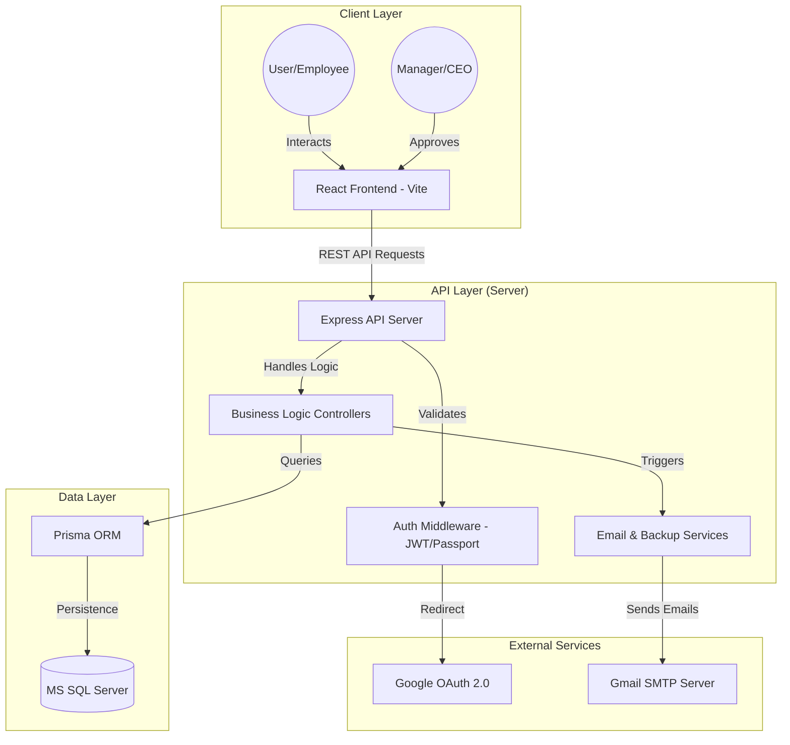
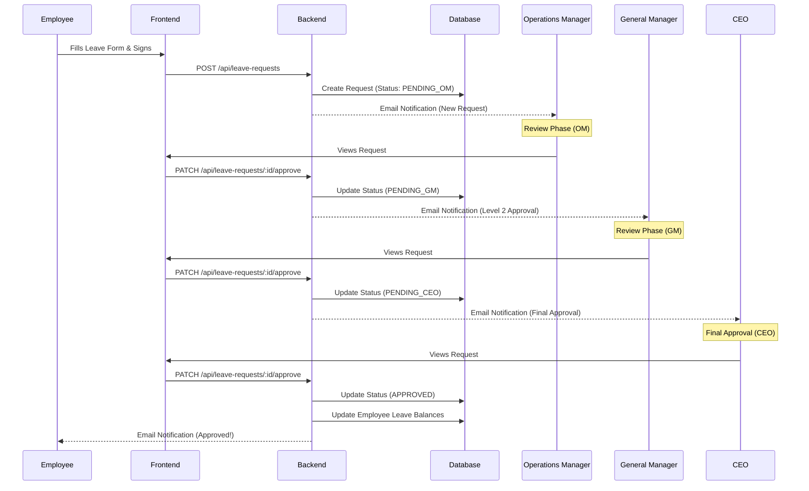
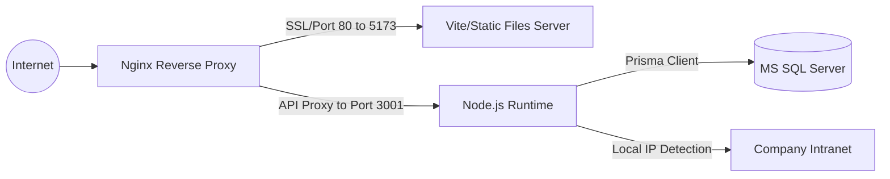

# Leave Tracker Architectural Flow

This document provides a comprehensive overview of the architecture and data flows for the Leave Tracker system.

## 1. High-Level System Architecture

The system follows a modern client-server architecture with a clear separation of concerns between the frontend, backend, and database layers.

## 2. Leave Request Lifecycle (Flow)

The following sequence diagram illustrates the flow of a leave request from submission to final approval.

## 3. Technology Stack Breakdown

| Layer | Technologies | Key Responsibilities |
| :--- | :--- | :--- |
| **Frontend** | React 18, TypeScript, Tailwind CSS, Shadcn/UI | UI/UX, State Management, PDF Generation (jsPDF), Client-side Validation. |
| **API Server** | Node.js, Express 5, TypeScript | Routing, Business Logic, RBAC (Role-Based Access Control), JWT Signing. |
| **Database** | Prisma (ORM), MS SQL Server | Data Persistence, Schema Migrations, Relationship Management. |
| **Security** | Passport.js (Google OAuth), JWT, bcrypt | User Authentication, Password Hashing, Session Management. |
| **Infrastructure** | Nodemailer, Nginx (Proxy), Windows Task Scheduler | Email Alerts, SSL Termination, Automated Database Backups. |

## 4. Key Security Flow (Authentication)

1. **Identification**: User selects "Login with Google" or enters Email/Password.
2. **Validation**: 
   - OAuth: Passport.js validates with Google servers.
   - Password: Bcrypt validates against hashed database password.
3. **Authorization**: Server issues a **JWT** containing User ID and Role.
4. **Persistent Access**: Frontend stores JWT and attaches it to the `Authorization` header for all subsequent API calls.
5. **Enforcement**: Backend middleware intercepts requests, decodes JWT, and verifies the user has the required role (e.g., `OPERATIONS_MANAGER`) to perform the action.

## 5. Deployment Topology

The application is optimized for deployment on a Windows Server environment using SQL Server.

