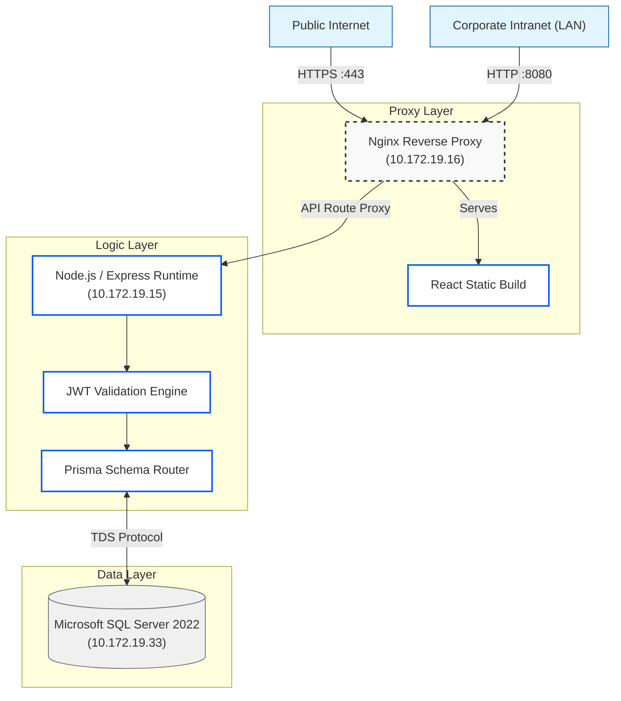
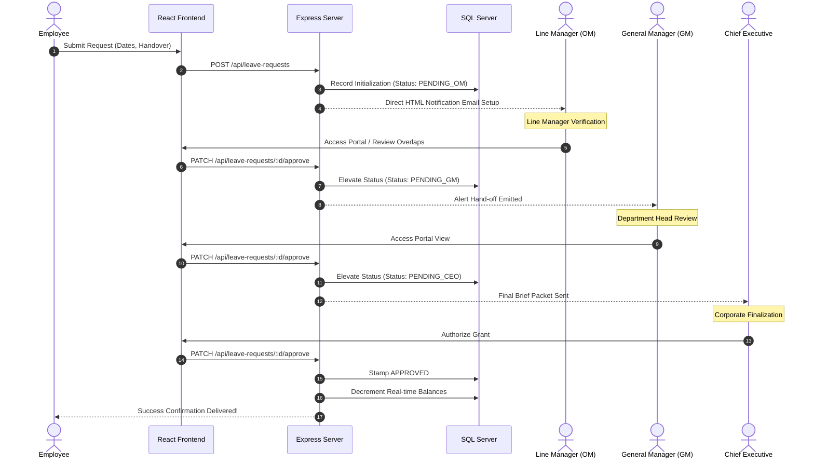

# 🏖️ Leave Tracker: Technical User Guide

Welcome to the **Leave Tracker Technical Reference Guide**. This document offers a comprehensive overview of the system's core capabilities, infrastructure topology, and internal logic flows. It is intended for administrators, developers, and DevOps personnel working with the Leave Tracker platform.

---

## 1. Core Functionalities

The Leave Tracker system simplifies employee leave processes through digital requests, seamless managerial workflows, and robust record-keeping tailored for modern enterprises.

### 👥 Personnel Management
- **Centralized Directory**: Maintain complete employee profiles, department mapping, and roles.
- **Dynamic Work Schedules**: Assign differing leave accrual patterns (e.g., standard Monday-Friday vs. Monday-Saturday).
- **Automated Balances**: Real-time tracking of Annual, Sick, Maternity, and Paternity leaves.
- **Bulk Imports**: Easily onboard entire departments via CSV/Excel imports.

### 📋 Request & Approval Engine
- **Digital Approvals**: Discards physical paperwork in favor of digital multi-level validation.
- **Smart Validations**: Prevents backdated entries and intelligently restricts overlapping dates across continuous and scattered leave arrangements.
- **Dynamic Routing**: Requests normally follow an **Operations Manager ➔ General Manager ➔ CEO** chain but dynamically divert to specialized tracks like **HOD Projects** based on the requester's department.
- **Company-Branded Portability**: Leaves approved internally can be seamlessly exported to high-contrast, official Navy/Gold PDF forms achieving 1:1 parity with UI previews.

### 📊 Analytics & Reporting
- **Holistic Calendars**: View integrated team availabilities across customizable monthly, weekly, and yearly layouts complete with avatar integration.
- **Real-Time KPIs**: Assess pending requests, absent headcounts, and individual balance analytics out of the box.

---

## 2. Infrastructure & Topology

The platform operates on a modernized Full-Stack application standard optimized for strict corporate deployment networks via a 3-VM paradigm.

> [!NOTE]
> The architectural schema emphasizes clear separation between proxy routing, runtime logic, and persistent storage.

### Tech Stack Definitions
- **Frontend Layer**: Built exclusively using `React 18` paired with `Vite` for optimized bundling. `Tailwind CSS`, `shadcn/ui`, and `Framer Motion` facilitate visual interfaces.
- **Backend Foundation**: Running on `Node.js` through the `Express 5` framework, fortified by `TypeScript` rigorous type-checks.
- **Storage Layer**: Database interactions are safely managed strictly using the `Prisma` Modern ORM acting against an Enterprise `Microsoft SQL Server`.

---

## 3. Communication Flow

All secure communications within the application ecosystem flow through well-defined and predictable sequential bounds.

> [!IMPORTANT]  
> All data modification APIs are rigorously protected via Bearer token structures and restrictive middleware enforcing Role-Based Access Controls (RBAC).

1. **Client Interaction**: Actions committed inside the React SPA (e.g. Submitting Leave) format into a REST payload.
2. **Gateway Clearance**: Payloads intercept the Backend Proxy passing through `JWT` validation. Requests missing valid Authorization headers or role clearances (like trying to access an Admin resource as a Standard Employee) are forcibly logged and dropped.
3. **Business Validation**: The application intersects Database parameters to check rules (e.g. checking existing overlapping dates).
4. **Execution & Feedback**: Changes are confirmed against the SQL Database. The Frontend updates its reactive state allowing the User to visually see their change take effect.

---

## 4. Multi-Level Lifecycle Processing

A core technical hurdle in managing the application is the fluid state management of "Approval Trajectories"—how the application alerts and waits for hierarchical managers.

> [!TIP]
> **Department Routes Alternative**: Keep in mind that specialized departments dynamically replace "OM" with immediate structural superiors like HODs based on relational mappings embedded cleanly inside the Database.

---

## 5. Deployment Overview
Deployment automation relies on a custom `PowerShell` orchestration wrapper allowing swift rollout. 
Developers build changes on the local environment while targeting proxy mappings. Utilizing scripts like `deploy-v2.ps1` pushes assets seamlessly onto the Windows Network structure guaranteeing zero downtime and maintaining standard connectivity across `10.172.X.X` namespaces.
